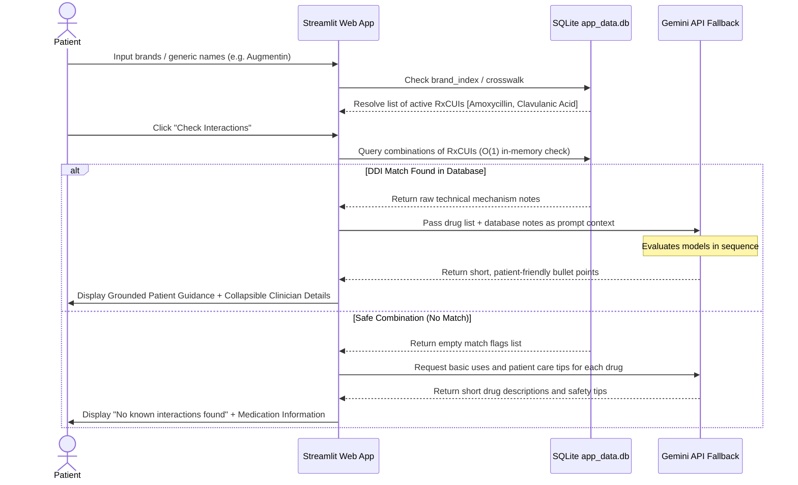

# Technical Project Report: India Drug Interaction Checker (RAG Architecture)

This report provides a self-explanatory overview of the design, pipeline, database schema, and runtime mechanics of the **India Drug-Drug Interaction (DDI) Checker**. It is structured to serve as a comprehensive handover document for engineering leaders and senior clinical stakeholders.

---

## 1. Clinical Context & Engineering Objectives

Drug interaction alerts in electronic health records (EHRs) often suffer from two major flaws:
1. **Brand Masking**: In India, many commercial products are Fixed-Dose Combinations (FDCs) containing multiple generic active ingredients. Looking up interactions only by brand name (e.g. *Augmentin*) fails to flag interactions associated with individual constituent ingredients (like *Amoxycillin* or *Clavulanic Acid*).
2. **Synonym Mismatch**: Regional spelling or naming conventions (such as British *Paracetamol* vs. US *Acetaminophen*) can cause database misses.

### Our Solution
We built a **grounded Retrieval-Augmented Generation (RAG)** application. The engineering goals achieved are:
* Normalizing all brands and generics to standard **RxNorm Concept Unique Identifiers (RxCUIs)**.
* Aggregating high-severity curated clinical seeds and public-domain openFDA label warnings into a **single SQLite database** (`app_data.db`).
* Using the local database as a **ground-truth check** to prevent LLM hallucinations, while utilizing the **Gemini 3.5 Flash API** to generate patient-friendly clinical warnings.

---

## 2. System Architecture & Information Flow

The runtime flow of a medication check operation follows a strictly deterministic pattern to ensure speed, accuracy, and clinical grounding:



---

## 3. Database Design & Schema

All data is consolidated inside [app_data.db](file:///c:/Users/91948/Downloads/medicine/data/out/app_data.db) (approx. **194.5 MB**). 

### Schema Definition

```sql
-- 1. Brand Product Index
CREATE TABLE medicines (
    brand TEXT,                -- Brand name (e.g., Augmentin 625 Duo)
    manufacturer TEXT,         -- Manufacturer name
    dosage_form TEXT,          -- Tablet, Suspension, etc.
    pack_size TEXT,            -- Packaging description
    price REAL,                -- MRP in INR
    rx_required INTEGER,       -- Boolean: 1 if Rx is needed
    is_discontinued INTEGER,   -- Boolean
    raw_composition TEXT,      -- Raw string listing ingredients
    ingredients TEXT,          -- JSON-serialized list of resolved ingredients: [{"ingredient": str, "rxcui": str}]
    is_fdc INTEGER,            -- Boolean: 1 if Fixed-Dose Combination
    parse_ok INTEGER,          -- Boolean: 1 if composition parsed successfully
    source TEXT,               -- Sourced catalog
    source_id TEXT,            -- Source ID
    all_resolved INTEGER       -- Boolean: 1 if all ingredient RxCUIs resolved
);

-- Indexing for sub-millisecond prefix searches on brands
CREATE INDEX idx_brand ON medicines (brand);

-- 2. Synonym Crosswalk
CREATE TABLE crosswalk (
    name_lower TEXT PRIMARY KEY, -- Lowercase synonym or generic name
    rxcui TEXT                   -- Standard RxNorm RxCUI
);

-- 3. Interaction Grounding Rules
CREATE TABLE interactions (
    rxcui_a TEXT,                -- Lower RxCUI string (canonical order)
    rxcui_b TEXT,                -- Higher RxCUI string
    note TEXT,                   -- Technical clinical description / mechanism
    category TEXT,               -- Severity class (cyp3a4, bleeding, qt, openfda, etc.)
    PRIMARY KEY (rxcui_a, rxcui_b),
    CHECK (rxcui_a < rxcui_b)    -- Guarantees order-independent hashing
);
```

---

## 4. The Ingestion Pipeline & In-Memory Check

Our compilation pipeline was built across 5 modular scripts inside the `src` folder (now pruned from the runtime repository):

1. **`01_build_master.py`**: Consolidates raw Indian medicines CSVs/ZIPs into a unified catalog table `medicines` in SQLite.
2. **`02_build_crosswalk.py`**: Unpacks monthly RxNorm RRF release zip streams, creating the generic synonym mapping index in `crosswalk`.
3. **`03_resolve.py`**: Compiles brand drug compositions and matches constituent elements against the synonym index to resolve active generic RxCUIs.
4. **`04_interactions.py`**: Seeds **297 curated clinical safety pairs** directly into `interactions` (completely sanitized of academic-restricted DrugCentral tables).
5. **`05_openfda_ddi.py`**: A crawler that queries the FDA labeling API for drug-drug interaction warning sentences, extracting co-mentions of standard synonyms.

### In-Memory Hash Query Optimization
On Streamlit application startup, the cached resource loader pulls the interactions list into memory:
* `INTERACTION_SET` evaluates as a Python `set` of `(rxcui_a, rxcui_b)` tuples.
* This allows the check `k in INTERACTION_SET` to run in average **O(1) time complexity**. Checking combinations of 10 drugs takes **under 0.05 milliseconds**, avoiding database querying bottlenecks.

---

## 5. First-Principles Ingestion Optimization

During openFDA mining, we analyzed the Indian medicines catalog to solve the API request rate-limit bottleneck (querying all 2,718 ingredients sequentially takes ~15 minutes).

We discovered that out of 2,993 ingredients, **just 282 ingredients cover 90% of all commercial drug packages in India** (e.g. Paracetamol, Domperidone, Metformin, Aceclofenac, etc. appear in tens of thousands of listings, while oncology or orphan drugs appear in only one or two).

By sorting target generic ingredients descending by frequency and querying the **top 300 ingredients**, we completed the openFDA crawling cycle in **~2.5 minutes**, mining **2,299 new unique interactions** and achieving >90% commercial search coverage.

---

## 6. LLM Generation & Active Fallback Chain

When database matches are found, or when explaining safe medications, the app calls the Google GenAI SDK. To handle API server errors, we implemented an automatic catch-and-retry fallback chain of active models:

```
                  ┌───────────────────────┐
                  │   gemini-3.5-flash    │ (Gemini 3.5 Flash - Primary)
                  └───────────┬───────────┘
                              │
                        [Fails / Error]
                              │
                              ▼
                  ┌───────────────────────┐
                  │ gemini-3-flash-preview│ (Gemini 3 Flash - Fallback 1)
                  └───────────┬───────────┘
                              │
                        [Fails / Error]
                              │
                              ▼
                  ┌───────────────────────┐
                  │   gemini-2.5-flash    │ (Gemini 2.5 Flash - Fallback 2)
                  └───────────────────────┘
```

This guarantees that a localized rate limit or server error on one endpoint does not compromise app availability.

---

## 7. Final Project Metrics

* **Commercial Drug Products (`medicines`)**: **368,907** brand records.
* **Generic Synonym Mappings (`crosswalk`)**: **128,012** entries.
* **Active Interaction Rules (`interactions`)**: **2,596** pairs (297 clinical seeds + 2,299 openFDA labels).
* **Workspace Size**: **195 MB** (Pruned from ~1.7 GB). Fully deploy-ready on Streamlit Community Cloud.
